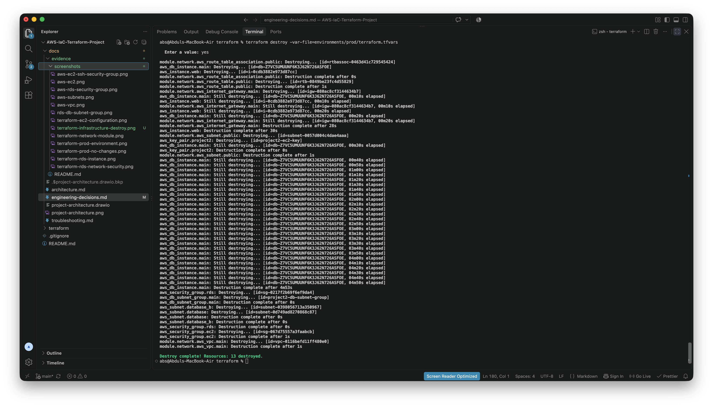

# AWS Infrastructure as Code with Terraform

## Overview

This project demonstrates the design, deployment and management of AWS infrastructure using Terraform and Infrastructure as Code (IaC) principles.

The project progressed from a simple network and EC2 deployment into a modular Terraform implementation incorporating private RDS connectivity, remote state, environment separation and production-oriented infrastructure decisions.

---

## Architecture


The deployed architecture includes:

- Amazon VPC
- Public subnet hosting an EC2 instance
- Internet Gateway and public routing
- EC2 security group with restricted SSH access
- Two database subnets across separate Availability Zones
- RDS DB subnet group
- Private Amazon RDS MySQL instance
- RDS security group permitting MySQL TCP `3306` only from the EC2 security group

Detailed architecture documentation is available in [`docs/architecture.md`](docs/architecture.md).

---

## Terraform Implementation

Terraform is used to define and manage the AWS infrastructure rather than manually provisioning resources through the AWS Console.

Key implementation features include:

- Reusable `network` module
- Variables and outputs
- Remote Terraform state using an Amazon S3 backend
- State locking and backend encryption
- Development, staging and production environment configuration
- Sensitive database credentials supplied at runtime rather than stored in source control
- Production-oriented RDS configuration

---

## Environment Separation

Environment-specific Terraform variable files are maintained for:

- Development
- Staging
- Production

This introduces an SDLC-style Development → Staging → Production workflow and allows infrastructure configuration to vary between environments while reusing the same Terraform codebase.

---

## Security

The infrastructure applies several security controls:

- SSH access to EC2 is restricted to a configured trusted CIDR.
- The RDS instance is not publicly accessible.
- MySQL TCP `3306` is permitted to RDS only from the EC2 security group.
- Database credentials are not hard-coded in Terraform or committed to Git.
- Terraform state and local state backups are excluded from source control.

---

## Engineering Decisions

The project includes documented engineering decisions covering:

- Terraform network module refactoring and state migration
- Remote Terraform state
- Development, staging and production separation
- RDS `apply_immediately` configuration
- Credential handling

See [`docs/engineering-decisions.md`](docs/engineering-decisions.md).

---

## Troubleshooting

A significant troubleshooting exercise involved RDS connectivity and DNS resolution.

The investigation isolated the EC2-to-RDS network path from DNS by testing the RDS private IP directly. Successful TCP `3306` and MySQL connectivity demonstrated that the VPC path, security groups, RDS instance and authentication were functioning before the remaining configuration issue was identified and corrected.

The complete evidence-based investigation is documented in [`docs/troubleshooting.md`](docs/troubleshooting.md).

---

## Evidence

Implementation and AWS deployment evidence is available in [`docs/evidence/README.md`](docs/evidence/README.md).

Evidence includes Terraform configuration, environment separation, production validation, VPC and subnet deployment, EC2, RDS and security-group configuration.

---

## Repository Structure

```text
AWS-IaC-Terraform-Project/
├── docs/
│   ├── evidence/
│   ├── architecture.md
│   ├── engineering-decisions.md
│   ├── troubleshooting.md
│   ├── project-architecture.drawio
│   └── project-architecture.png
├── terraform/
│   ├── environments/
│   │   ├── dev/
│   │   ├── staging/
│   │   └── prod/
│   ├── modules/
│   │   └── network/
│   ├── backend.tf
│   ├── main.tf
│   ├── outputs.tf
│   ├── provider.tf
│   └── variables.tf
├── .gitignore
└── README.md
```

---

## Project Status

Infrastructure implementation and engineering documentation are complete.

Final validation, production deployment review and infrastructure cleanup are performed as part of the project closeout process.

---

## Infrastructure Teardown and Cost Management

After deployment, validation and evidence capture were completed, the live AWS infrastructure was intentionally destroyed using Terraform to prevent unnecessary ongoing cloud costs.



Terraform successfully removed all 13 managed resources, demonstrating controlled infrastructure teardown as part of the project's Infrastructure as Code lifecycle.

The Terraform configuration remains version controlled and can be used to provision the infrastructure again when required.
