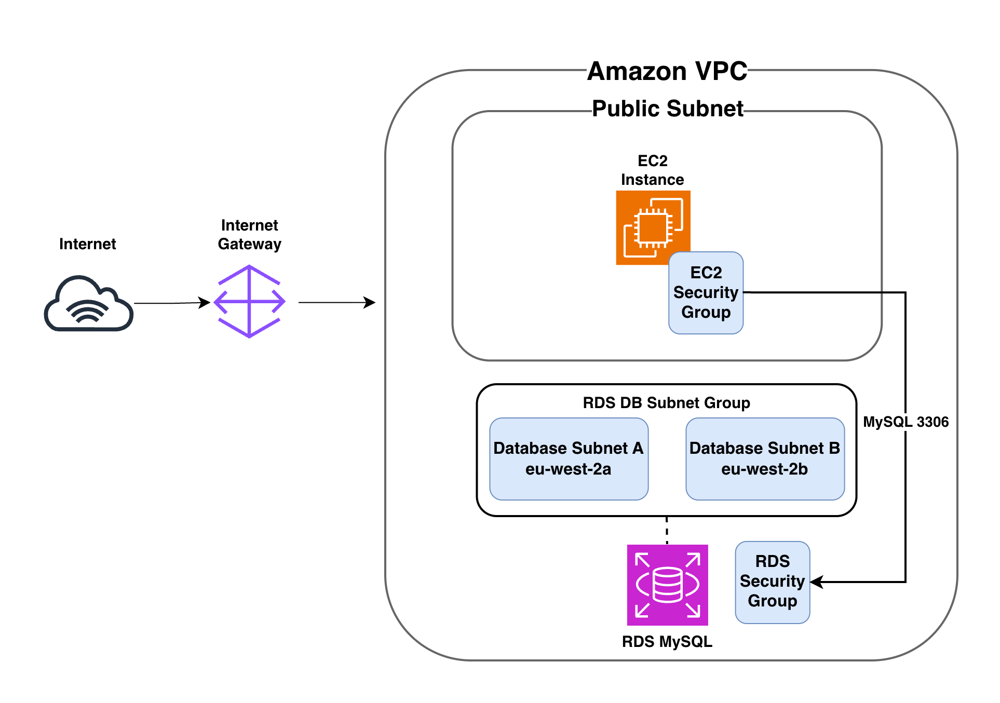

# AWS IaC Terraform Project – Architecture

## Objective

Deploy a production-style AWS environment with Terraform using Infrastructure as Code (IaC) principles.

## Planned Architecture

## Components

- VPC – Isolated private network.
- Public Subnet – Hosts internet-facing resources.
- Internet Gateway – Enables internet access.
- Route Table – Routes traffic to the Internet Gateway.
- Security Group – Firewall controlling inbound/outbound traffic.
- EC2 Instance – Linux virtual machine running the application.

## Infrastructure as Code

All infrastructure will be created, updated and removed using Terraform rather than manually through the AWS Console.
