# Infrastructure Evidence

This directory contains selected evidence demonstrating that the AWS infrastructure was provisioned and managed using Terraform, with AWS Console screenshots used to verify the resulting deployed resources.

The evidence is intentionally concise: Terraform configuration demonstrates the infrastructure-as-code implementation, while AWS Console evidence confirms that the expected resources were successfully created in AWS.

---

## Terraform Implementation

### Network Module

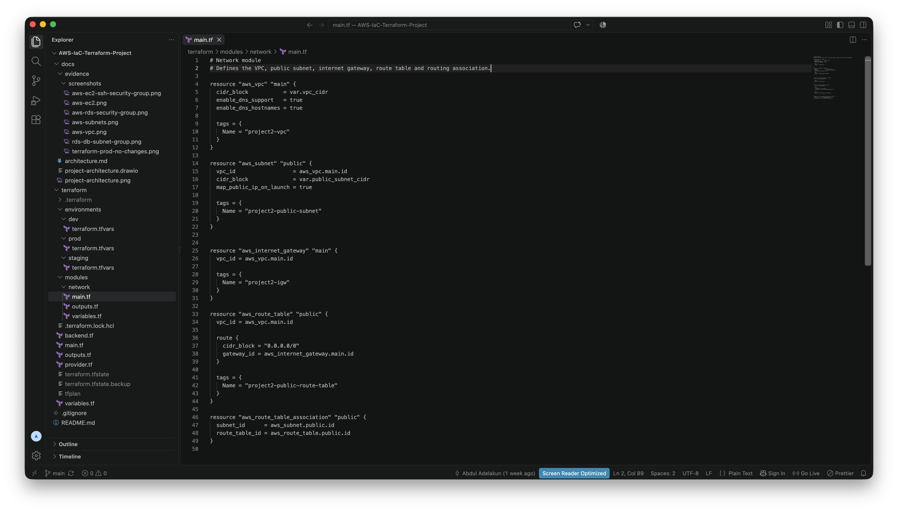

Reusable Terraform network module defining the VPC, public subnet, Internet Gateway, route table, and routing association.

### EC2 Configuration

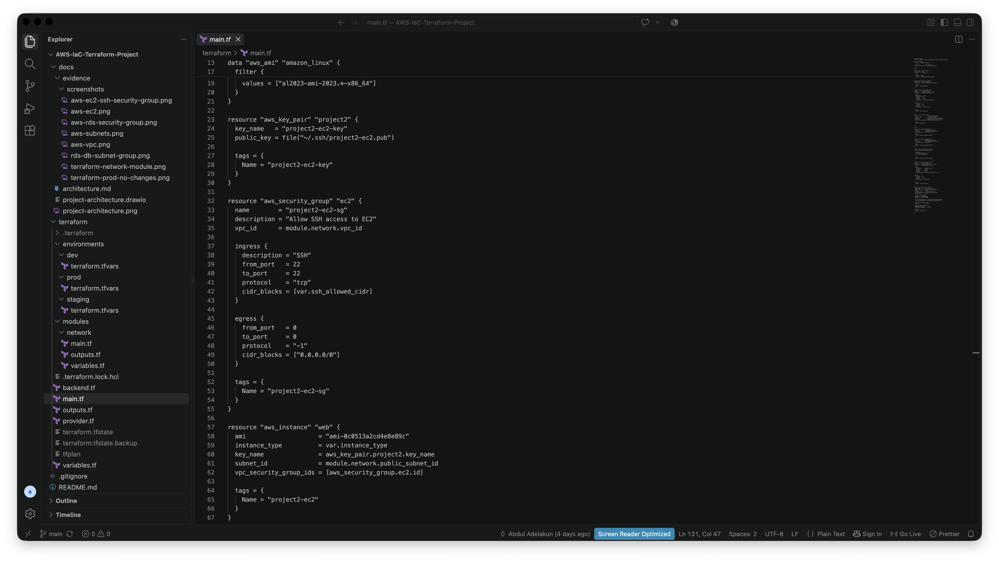

Terraform configuration for the EC2 instance, SSH key pair, public-subnet placement, and security group with SSH access restricted by the configured CIDR variable.

### RDS Configuration

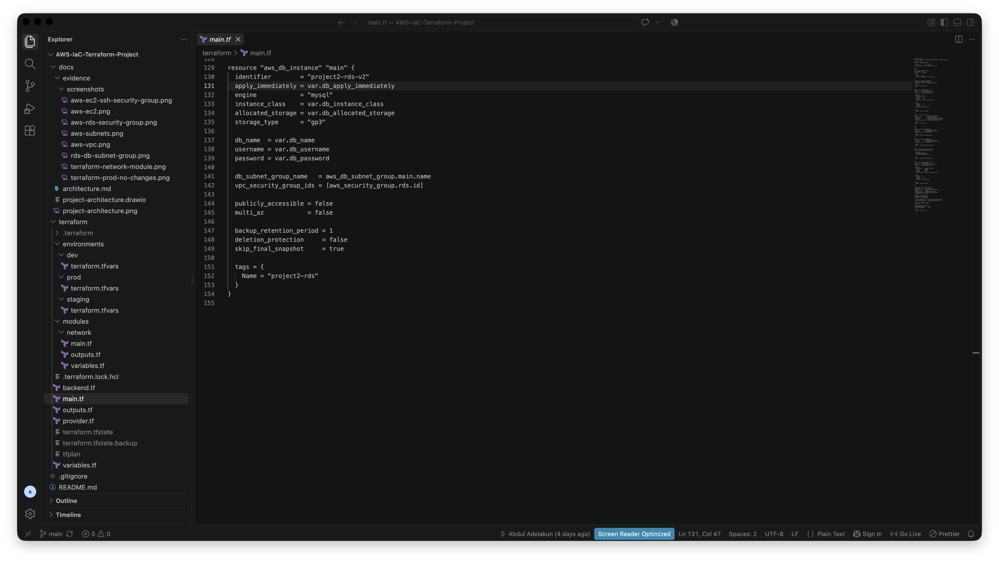

Terraform configuration for the MySQL RDS instance, including variable-driven database settings, DB subnet group association, security group attachment, and disabled public accessibility.

### RDS Network Security

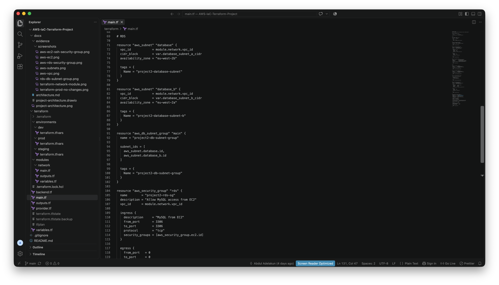

Terraform configuration demonstrating two database subnets across separate Availability Zones and an RDS security group permitting MySQL traffic on port 3306 from the EC2 security group only.

---

## Environment Separation

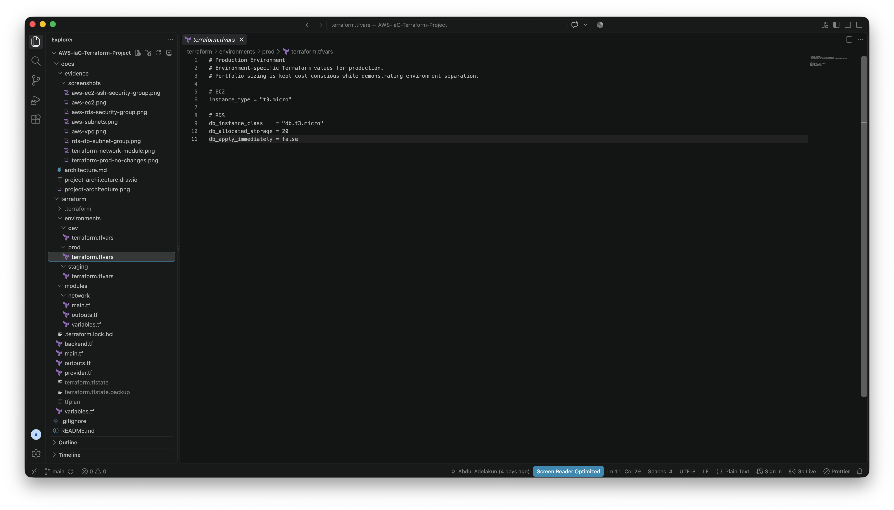

Production-specific Terraform values demonstrating separation between development, staging, and production configuration.

---

## Production Validation

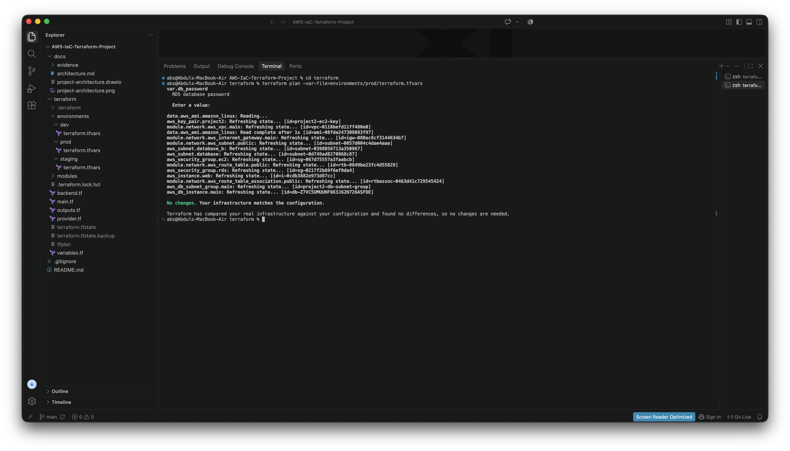

Terraform production plan confirming that the deployed infrastructure matches the configuration with no outstanding changes.

---

## AWS Deployment Verification

### VPC

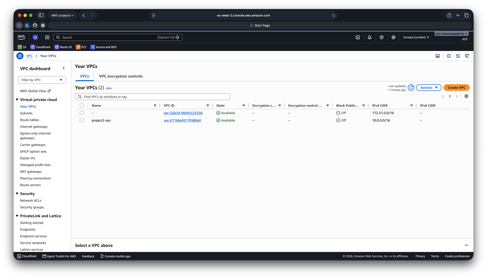

AWS Console verification of the Terraform-managed VPC.

### Subnets

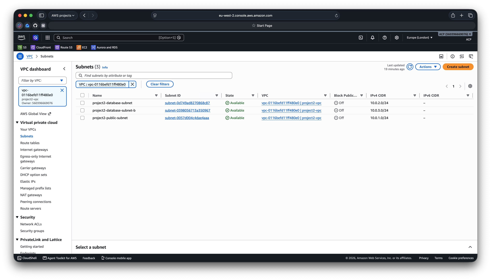

AWS Console verification of the deployed subnet infrastructure.

### EC2 Instance

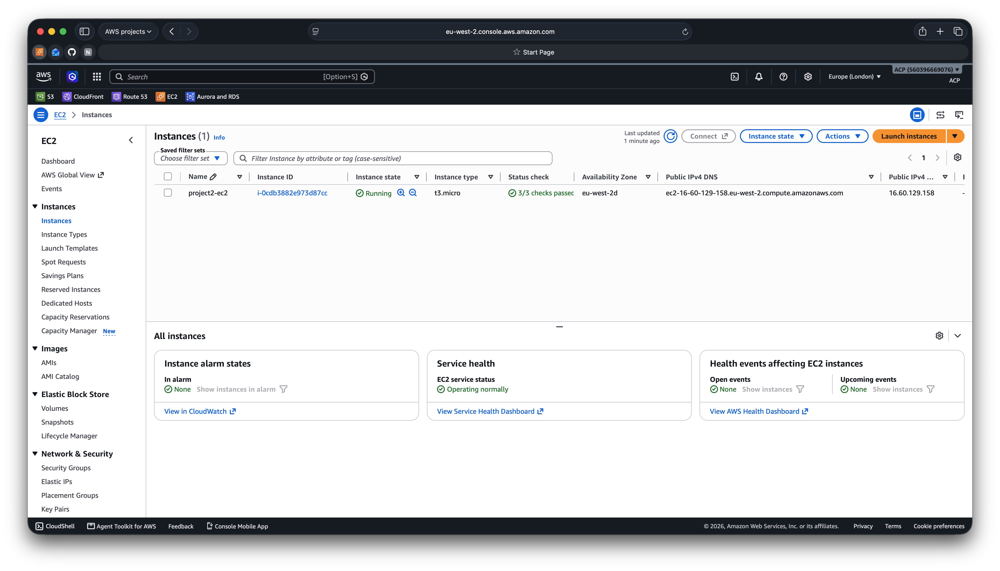

AWS Console verification of the deployed EC2 instance.

### EC2 SSH Security

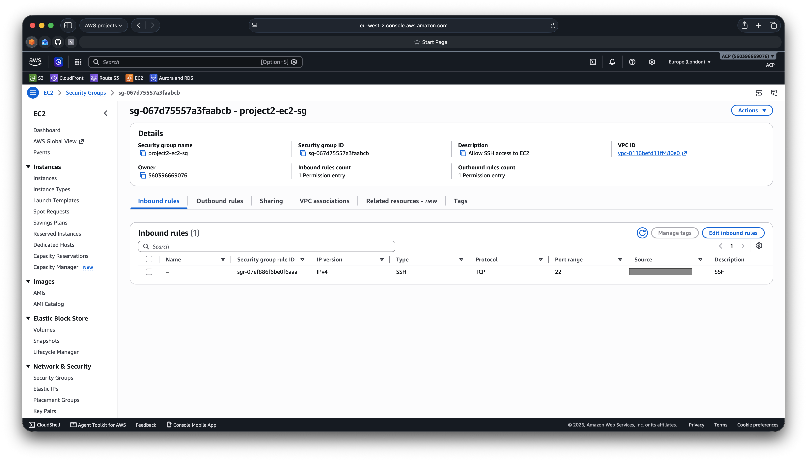

AWS Console verification of the EC2 security group's restricted SSH ingress rule.

### RDS DB Subnet Group

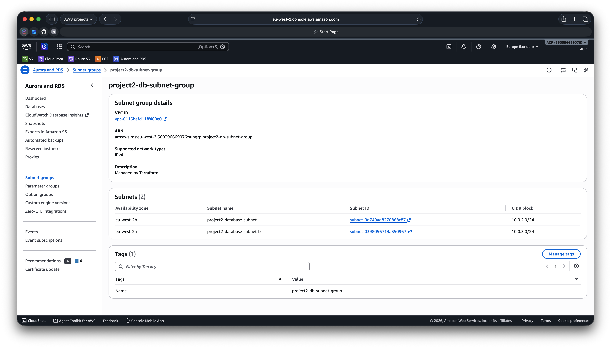

AWS Console verification of the RDS DB subnet group spanning two Availability Zones.

### RDS Security

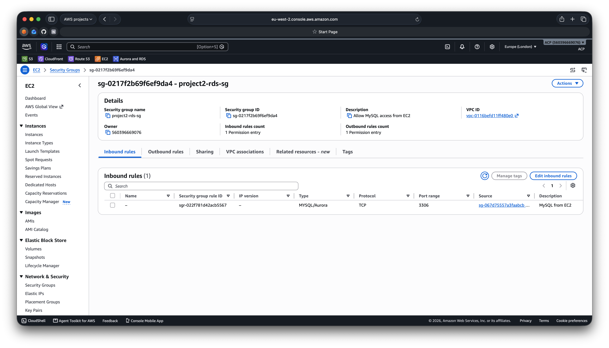

AWS Console verification that MySQL access to RDS is restricted to the EC2 security group.
